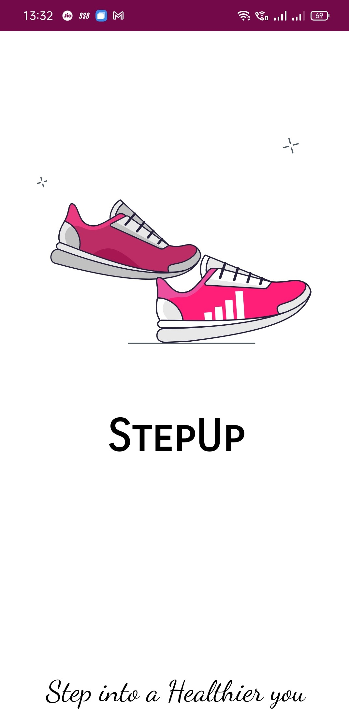
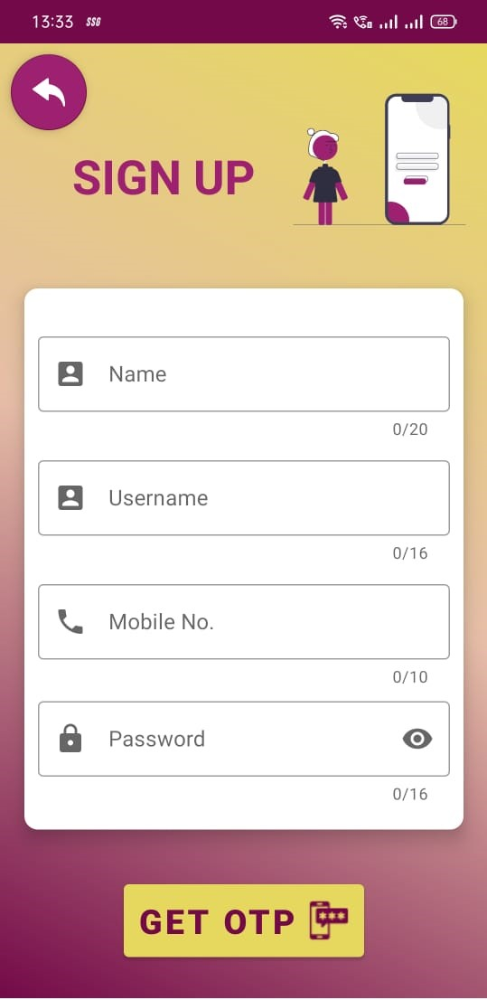

# StepUp : Pedometer & BMI Application

StepUp is an Android mobile applictaion which acts as a Step counter (pedometer) and an application to keep track of user's BMI.

## Problem Definition✨
- In this fast-paced world, most people have adopted a sedentary lifestyle, which is a cause of obesity, diabetes, and other lifestyle-related issues.
- Many people are unaware of no. of steps they take in a day even though it being a simple yet effective measure of their physical activity level.
- In real world, carrying an external pedometer device is not a feasible approach to count steps.

## Proposed Application (Features)

 - StepUp is a mobile application which aims to address all the above mentioned problems by allowing user to track their steps via mobile inbuilt Accelerometer sensor.
 - The application enables user to measure his/her BMI (Body Mass Index).
 - User can view following stats on the home screen of application :  &nbsp;&nbsp;&nbsp;&nbsp; - No. of steps 👣
  &nbsp;&nbsp;&nbsp;&nbsp; - distance covered (in kms)
  &nbsp;&nbsp;&nbsp;&nbsp; - Daily Step Goal 🚩
  &nbsp;&nbsp;&nbsp;&nbsp; - calories burnt 🔥
  &nbsp;&nbsp;&nbsp;&nbsp; - BMI (Body Mass Index)

 - Application also provides user with past activity data plotted on a graph 📊.

 ## Screenshots ✨
<table>
    <tr>
        <td></td>
        <td></td>
        <td></td>
    </tr>
    <tr>
        <td></td>
        <td></td>
        <td></td>
    </tr>
</table>
 

## Tech Stack 👨‍💻

- Java
- XML
- Firebase

